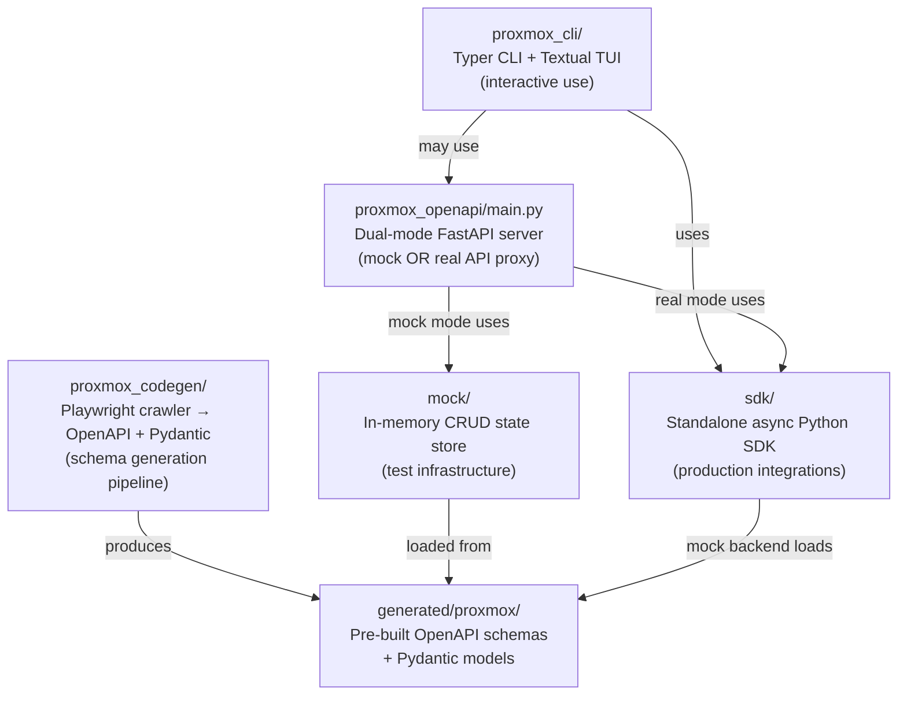
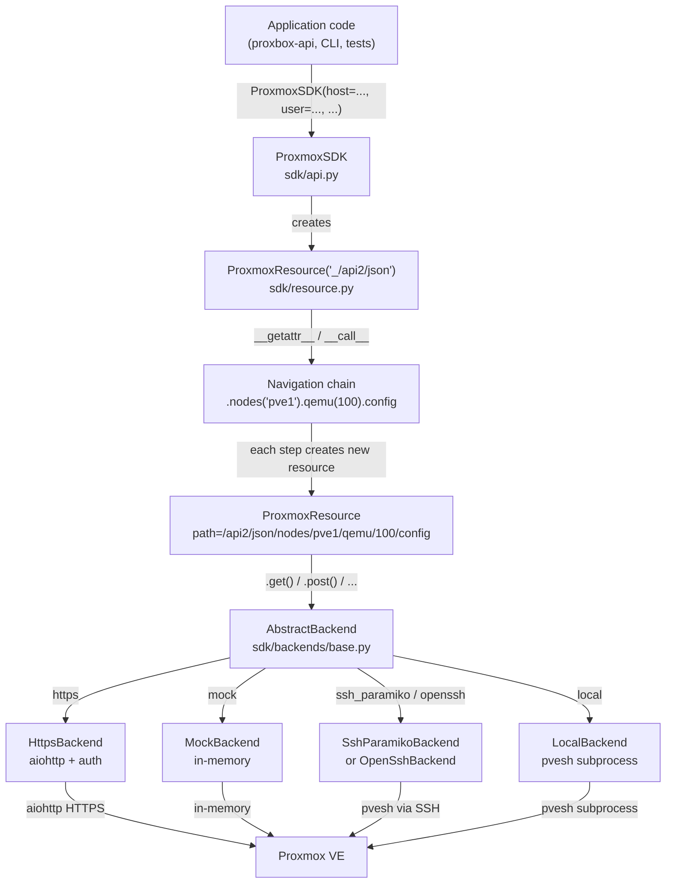
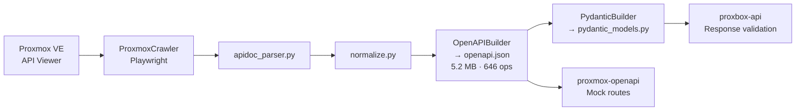

# Architecture

This page describes the internal architecture of `proxmox-openapi` — covering the package layers, the dual-mode FastAPI server, the standalone SDK, and the key design decisions behind each component.

---

## Package Layers

The project is organized into five distinct layers, each independently usable:



| Layer | Entry point | Standalone? | Description |
|---|---|---|---|
| `sdk/` | `proxmox_openapi.ProxmoxSDK` | Yes | Async + sync Python SDK with 5 backends |
| `mock/` | `proxmox_openapi.mock_main` | Yes | FastAPI mock server only |
| `proxmox_openapi/main.py` | `proxmox_openapi.main` | Yes | Dual-mode FastAPI server |
| `proxmox_codegen/` | `proxmox codegen` CLI | Yes | Schema generation pipeline |
| `proxmox_cli/` | `proxmox` / `pbx` CLI | Yes | Typer CLI and Textual TUI |

---

## Dual-Mode FastAPI Server

The FastAPI server can run in two modes, selected via `PROXMOX_API_MODE`:

=== "Mock Mode (default)"

    Mock mode loads pre-generated OpenAPI schemas and dynamically creates CRUD endpoints backed by an in-memory state store. No real Proxmox server required.

    ```mermaid
    flowchart TD
        REQ["HTTP Request"]
        ROUTER["FastAPI Router"]
        MOCK_EP["Generated Mock Endpoint\n(from OpenAPI schema)"]
        STATE["SharedMemoryMockStore\nin-memory dict"]
        RESP["JSON Response"]

        REQ --> ROUTER
        ROUTER --> MOCK_EP
        MOCK_EP -->|"GET: read"| STATE
        MOCK_EP -->|"POST/PUT: write"| STATE
        MOCK_EP -->|"DELETE: remove"| STATE
        STATE --> RESP
    ```

    **Startup flow:**

    1. Load `generated/proxmox/latest/openapi.json`
    2. `register_generated_proxmox_mock_routes()` iterates all 646 path/method pairs
    3. For each operation, create a dynamic FastAPI route with Pydantic request/response validation
    4. Routes perform CRUD on `SharedMemoryMockStore`
    5. State persists only in memory — resets on restart

    **Performance:** ~1 second startup, <5 ms per request, ~100 MB memory.

=== "Real Mode"

    Real mode proxies requests to an actual Proxmox VE API, validating both the incoming request and the Proxmox response against the OpenAPI schema.

    ```mermaid
    flowchart TD
        REQ["HTTP Request"]
        ROUTER["FastAPI Router"]
        REAL_EP["Real API Endpoint\n(validates request)"]
        CLIENT["ProxmoxClient\n(HttpsBackend)"]
        PVE["Real Proxmox VE\n:8006"]
        VALID["Response Validation\n(Pydantic)"]
        RESP["JSON Response"]

        REQ --> ROUTER
        ROUTER --> REAL_EP
        REAL_EP --> CLIENT
        CLIENT -->|"aiohttp HTTPS"| PVE
        PVE -->|"JSON data"| CLIENT
        CLIENT --> VALID
        VALID --> RESP
    ```

    **Startup flow:**

    1. Load `ProxmoxConfig` from environment variables
    2. `register_proxmox_routes()` creates endpoints mirroring the mock structure
    3. Each request: validate → call `ProxmoxClient.request()` → validate response → return

    **Performance:** ~500 ms startup, Proxmox latency + ~20–100 ms validation overhead.

---

## SDK Architecture

The standalone SDK (`sdk/`) is the primary way for Python applications to query Proxmox programmatically without running the FastAPI server.



---

## Code Generation Pipeline

The codegen pipeline converts the Proxmox VE API Viewer into reusable artifacts:



See [Code Generation Pipeline](codegen-pipeline.md) for the full stage-by-stage breakdown.

---

## Key Design Decisions

### 1. Dual-Mode Architecture

A single codebase serves both development (mock) and production (real proxy) use cases. The same API surface — same paths, same schemas, same validation — is available in both modes. Switching from mock to real is a single environment variable change.

| | Mock | Real |
|---|---|---|
| **Proxmox server required** | No | Yes |
| **Data persistence** | In-memory (reset on restart) | Real Proxmox state |
| **Request validation** | Yes (Pydantic) | Yes (Pydantic) |
| **Response validation** | Yes (Pydantic) | Yes (Pydantic) |
| **Startup time** | ~1 s | ~500 ms |

### 2. Dynamic Route Generation

Rather than hardcoding 646 routes, the server registers them at startup from the OpenAPI schema. This means schema updates automatically produce new routes with zero manual work. Startup takes ~1 second for schema loading plus route generation.

### 3. Pre-Generated Schemas

The OpenAPI schema and Pydantic models are committed to the repository so mock mode works completely offline without a Proxmox server. Each version (e.g., `8.1.0`) is stored independently under `generated/proxmox/`.

### 4. Full Request/Response Validation

Every request body and response passes through Pydantic v2 validation against the OpenAPI-derived models. This enforces type correctness, produces accurate Swagger UI documentation, and catches schema drift between the SDK and Proxmox API.

### 5. In-Memory Mock State

Mock state uses `SharedMemoryMockStore` — a dict-based in-memory store with shared read locks (`LOCK_SH`) and exclusive write locks (`LOCK_EX`) for thread safety. No database dependency, zero configuration, trivially resettable. It uses a materialised `set` for deleted-item checks (`O(1)` membership test).

### 6. aiohttp for HTTPS Transport

The HTTPS backend uses `aiohttp` for its native async/await support, mature session pooling, and robust SSL/TLS handling. The session is created lazily on first request and reused across all subsequent calls.

---

## Security Model

### Mock Mode

- No authentication by default — safe for development environments
- Rate-limited at the FastAPI level (`PROXMOX_RATE_LIMIT`)
- Codegen endpoints require `CODEGEN_API_KEY` Bearer token

### Real Mode

- All outbound Proxmox calls use API token auth (recommended) or password/ticket auth
- SSL/TLS verification configurable via `PROXMOX_API_VERIFY_SSL`
- No credentials stored in memory after session initialization
- `SensitiveDataFilter` redacts passwords and tokens from all log output

See [Security](security.md) for the full reference.

---

## Performance Characteristics

| Metric | Mock Mode | Real Mode |
|---|---|---|
| Startup time | ~1 s | ~500 ms |
| Request latency | <5 ms | Proxmox latency + ~20–100 ms |
| Memory footprint | ~100 MB | ~80 MB |
| Max throughput | 10,000+ req/s (FastAPI-bound) | Proxmox server capacity |

Key optimizations:

- **Lazy package imports** — `import proxmox_openapi` does not construct any FastAPI app
- **Cached URL components** — `HttpsBackend` caches `(scheme, netloc, base_path)` to skip per-request URL parsing
- **Shared read locks** — concurrent GETs on mock state do not block each other
- **Schema fingerprint caching** — `ProxmoxSchemaValue.fingerprint` is a `@cached_property`

See [Performance](performance.md) for the complete optimization reference.

---

## Extension Points

1. **Custom mock data** — Point `PROXMOX_MOCK_DATA_PATH` at a JSON/YAML file with initial mock state
2. **New Proxmox version** — Run the codegen pipeline, store artifacts under `generated/proxmox/<version>/`
3. **Custom middleware** — Add FastAPI middleware for auth, logging, or rate limiting in `main.py`
4. **New SDK backend** — Implement `AbstractBackend.request()` and `AbstractBackend.close()`, register in `_create_backend()`

---

## Testing Strategy

| Test type | Scope | File |
|---|---|---|
| Unit | Schema loading and validation | `test_schema.py` |
| Unit | Individual CRUD operations | `test_mock_routes.py` |
| Unit | Client auth and request logic | `test_proxmox_client.py` (mocked) |
| Integration | Full app startup in both modes | `test_main_app.py` |
| Integration | Custom mock data loading | `test_custom_mock_data.py` |
| E2E | Manual via Swagger UI | — |
| E2E | Real Proxmox environment | Requires live cluster |
