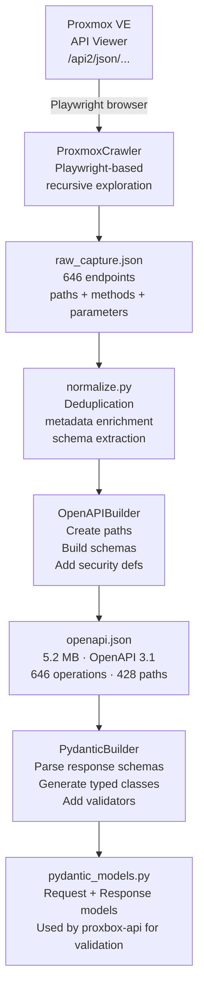
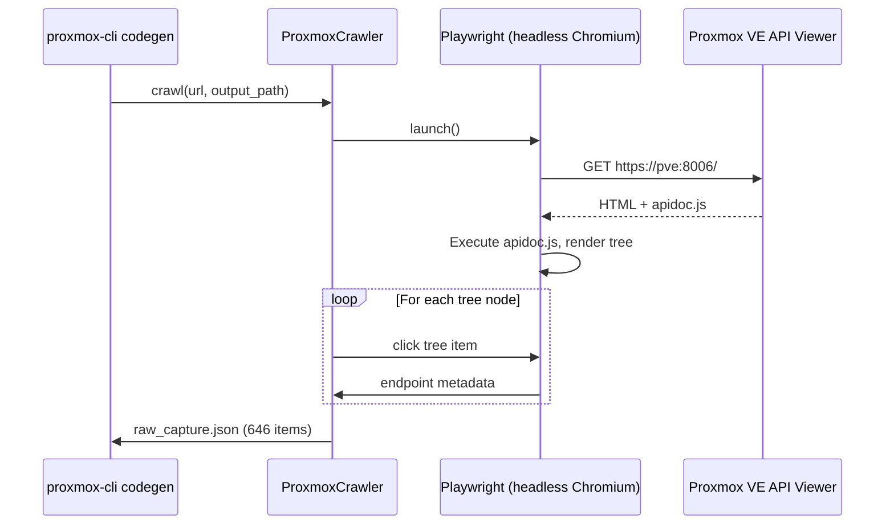

# Code Generation Pipeline

The `proxmox-sdk` project ships a complete pipeline that crawls the Proxmox VE API Viewer and converts it into an OpenAPI 3.1 schema and Pydantic v2 models. The generated artifacts are checked into `proxmox_sdk/generated/` so users never need to run the pipeline themselves.

---

## Pipeline Overview



All pipeline stages are orchestrated by `ProxmoxCodegenPipeline` in `proxmox_codegen/pipeline.py`.

---

## Stage 1: Crawler (`ProxmoxCrawler`)

`proxmox_codegen/crawler.py` uses **Playwright** to drive a headless browser against the Proxmox API Viewer web application. The Proxmox API Viewer renders its endpoint tree from an embedded `apidoc.js` file rather than serving plain JSON, so a browser is required to execute the JavaScript.

The crawler:

1. Navigates to the Proxmox API Viewer at `https://<host>:8006`
2. Waits for `apidoc.js` to load and the tree to render
3. Recursively expands every tree node
4. For each endpoint, captures: path, HTTP methods, parameters, request/response schemas, descriptions



!!! warning "Crawler requires a real Proxmox host"
    The crawler must connect to a real Proxmox VE instance to render the API Viewer. The pre-generated schemas shipped with this package were produced from Proxmox VE 8.1. Re-running the crawler requires `PROXMOX_URL`, valid credentials, and network access.

---

## Stage 2: Parser (`apidoc_parser.py`)

`proxmox_codegen/apidoc_parser.py` post-processes the raw capture. It:

- Normalizes path parameter syntax (`{vmid}` → `{vmid: integer}`)
- Extracts inline schemas from parameter definitions
- Resolves enum values for string parameters
- Handles Proxmox-specific documentation quirks (e.g., undocumented query params)

---

## Stage 3: Normalization (`normalize.py`)

`proxmox_codegen/normalize.py` deduplicates endpoints and enriches metadata:

- **Deduplication**: Some Proxmox API paths appear in multiple tree branches; the normalizer collapses them
- **Type enrichment**: Proxmox uses custom type annotations; these are mapped to JSON Schema types
- **Tag assignment**: Groups endpoints by resource category (nodes, storage, cluster, etc.)
- **Operation ID generation**: Creates unique `operationId` values for each operation

---

## Stage 4: OpenAPI Builder (`openapi_generator.py`)

`proxmox_codegen/openapi_generator.py` produces an **OpenAPI 3.1** JSON document:

| Stat | Value |
|---|---|
| Operations | 646 |
| Paths | 428 |
| File size | ~5.2 MB |
| Format | OpenAPI 3.1 |
| Security schemes | `ApiToken` (API token), `TicketAuth` (password/ticket) |

The builder adds:

- Path item objects with all supported HTTP methods
- Parameter objects for path, query, and body parameters
- Response schemas with Proxmox `data` envelope
- Reusable component schemas for shared types
- Security requirement declarations per operation

---

## Stage 5: Pydantic Generator (`pydantic_generator.py`)

`proxmox_codegen/pydantic_generator.py` converts the OpenAPI response schemas into **Pydantic v2** model classes. These models are used by `proxbox-api` to validate SDK responses against the expected schema.

### How proxbox-api Uses Generated Models

Generated models live at:
```
proxbox_api/generated/proxmox/latest/pydantic_models.py
```

Every typed helper in `proxbox_api/services/proxmox_helpers.py` imports and uses these models:

```python
from proxbox_api.generated.proxmox.latest import pydantic_models as generated_models

# After SDK call:
validated = generated_models.GetClusterStatusResponse.model_validate(result)
# Returns typed List[GetClusterStatusResponseItem] — validated against schema
```

The naming convention follows the OpenAPI `operationId`:

| Proxmox endpoint | Generated model |
|---|---|
| `GET /cluster/status` | `GetClusterStatusResponse` |
| `GET /cluster/resources` | `GetClusterResourcesResponse` |
| `GET /nodes/{node}/qemu/{vmid}/config` | `GetNodesNodeQemuVmidConfigResponse` |
| `GET /nodes/{node}/lxc/{vmid}/config` | `GetNodesNodeLxcVmidConfigResponse` |
| `GET /storage` | `GetStorageResponse` |
| `GET /storage/{storage}` | `GetStorageStorageResponse` |
| `GET /nodes/{node}/storage/{storage}/content` | `GetNodesNodeStorageStorageContentResponse` |
| `GET /nodes/{node}/tasks` | `GetNodesNodeTasksResponse` |
| `GET /nodes/{node}/tasks/{upid}/status` | `GetNodesNodeTasksUpidStatusResponse` |

---

## Triggering the Pipeline

The codegen pipeline is exposed as a protected API endpoint on the FastAPI server and as CLI commands:

=== "REST API"

    ```bash
    # Generate schema from Proxmox API Viewer (rate-limited: 1/hour)
    curl -X POST https://your-proxbox-api/codegen/generate \
      -H "Authorization: Bearer $CODEGEN_API_KEY" \
      -H "Content-Type: application/json" \
      -d '{"proxmox_url": "https://pve.example.com:8006"}'

    # Retrieve generated OpenAPI schema
    curl -H "Authorization: Bearer $CODEGEN_API_KEY" \
      https://your-proxbox-api/codegen/openapi

    # Retrieve generated Pydantic models (rate-limited: 5/hour)
    curl -H "Authorization: Bearer $CODEGEN_API_KEY" \
      https://your-proxbox-api/codegen/pydantic
    ```

=== "CLI"

    ```bash
    # Run full pipeline against a Proxmox host
    proxmox codegen generate --url https://pve.example.com:8006

    # List available generated versions
    proxmox codegen versions
    ```

---

## Security Controls

The codegen pipeline has strict security controls because it makes outbound HTTP requests to user-supplied URLs.

### SSRF Protection

`proxmox_codegen/security.py` validates all user-supplied URLs before any outbound request:

```python
validate_source_url(url, allow_any_domain=False)
```

Blocked addresses:
- Private IPv4 ranges (RFC 1918): `10.x.x.x`, `172.16-31.x.x`, `192.168.x.x`
- Loopback: `127.x.x.x`, `::1`
- Private IPv6
- IPv4-mapped IPv6 (`::ffff:...`)
- 6to4 addresses (`2002::/16`)

Only addresses that resolve to public Proxmox VE API endpoints are allowed by default.

### API Key Auth

All codegen endpoints require `Authorization: Bearer <CODEGEN_API_KEY>`. The key is set via the `CODEGEN_API_KEY` environment variable at server startup.

### Rate Limiting

| Endpoint | Rate limit |
|---|---|
| `POST /codegen/generate` | 1 request / hour |
| `GET /codegen/pydantic` | 5 requests / hour |
| `GET /codegen/openapi` | No limit (read-only) |

---

## Versioning

Generated artifacts are stored under `generated/proxmox/<version>/`:

```
proxmox_sdk/
└── generated/
    └── proxmox/
        ├── latest/       ← symlink to most recent version
        │   ├── openapi.json
        │   └── pydantic_models.py
        └── 8.1.0/
            ├── openapi.json
            └── pydantic_models.py
```

The SDK reads the version to use from `PROXMOX_MOCK_SCHEMA_VERSION` (default: `"latest"`). Multiple versions can coexist; `GET /versions/` lists all available versions.

---

## Updating the Schema

To update to a new Proxmox VE version:

1. Run the codegen pipeline against the new Proxmox version
2. Store the new artifacts in `generated/proxmox/<new-version>/`
3. Update the `latest` symlink
4. Re-run `proxbox-api` to pick up the new models

!!! note "proxbox-api model imports"
    `proxbox-api` always imports from `proxbox_api.generated.proxmox.latest`. If you update the `latest` version, regenerate the proxbox-api generated models by running the proxbox-api codegen pipeline as well. The two generated artifact sets must be in sync.
