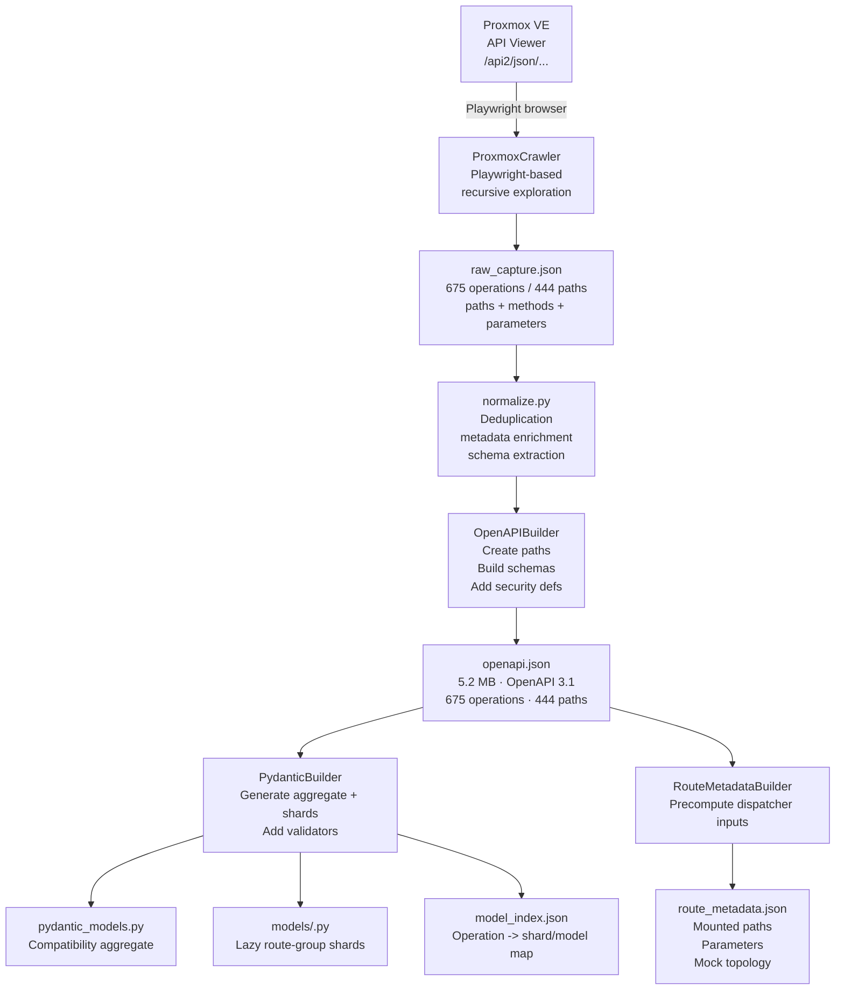
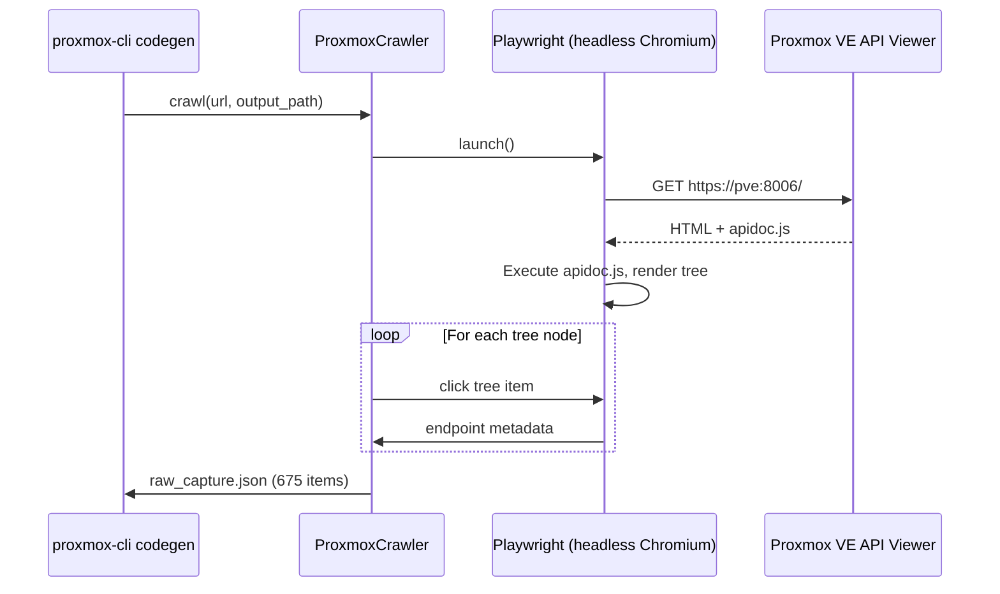
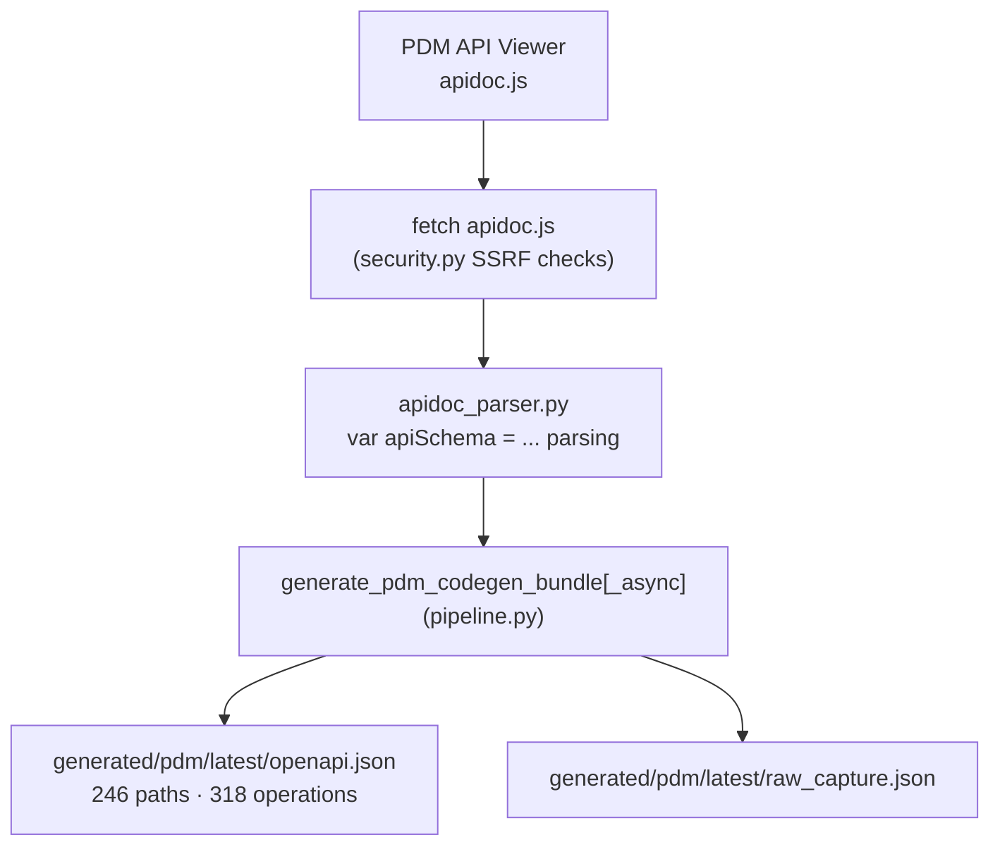

# Code Generation Pipeline

The `proxmox-sdk` project ships a complete pipeline that crawls the Proxmox VE
API Viewer and converts it into OpenAPI 3.1, Pydantic v2 models, runtime route
metadata, and lazy model shards. The generated artifacts are checked into
`proxmox_sdk/generated/` so users never need to run the pipeline themselves.

---

## Pipeline Overview


```mermaid
flowchart TD
    PVE["Proxmox VE\nAPI Viewer\n/api2/json/..."]

    CRAWL["ProxmoxCrawler\nPlaywright-based\nrecursive exploration"]
    RAW["raw_capture.json\n675 operations / 444 paths\npaths + methods + parameters"]
    NORM["normalize.py\nDeduplication\nmetadata enrichment\nschema extraction"]
    OPENAPI_GEN["OpenAPIBuilder\nCreate paths\nBuild schemas\nAdd security defs"]
    OPENAPI["openapi.json\n5.2 MB · OpenAPI 3.1\n675 operations · 444 paths"]
    PYDANTIC_GEN["PydanticBuilder\nGenerate aggregate + shards\nAdd validators"]
    PYDANTIC["pydantic_models.py\nCompatibility aggregate"]
    SHARDS["models/<group>.py\nLazy route-group shards"]
    INDEX["model_index.json\nOperation -> shard/model map"]
    ROUTES_GEN["RouteMetadataBuilder\nPrecompute dispatcher inputs"]
    ROUTES["route_metadata.json\nMounted paths\nParameters\nMock topology"]

    PVE -->|"Playwright browser"| CRAWL
    CRAWL --> RAW
    RAW --> NORM
    NORM --> OPENAPI_GEN
    OPENAPI_GEN --> OPENAPI
    OPENAPI --> PYDANTIC_GEN
    PYDANTIC_GEN --> PYDANTIC
    PYDANTIC_GEN --> SHARDS
    PYDANTIC_GEN --> INDEX
    OPENAPI --> ROUTES_GEN
    ROUTES_GEN --> ROUTES
```

All pipeline stages are orchestrated by `generate_proxmox_codegen_bundle()` in
`proxmox_codegen/pipeline.py`.

---

## Stage 1: Crawler (`ProxmoxCrawler`)

`proxmox_codegen/crawler.py` uses **Playwright** to drive a headless browser against the Proxmox API Viewer web application. The Proxmox API Viewer renders its endpoint tree from an embedded `apidoc.js` file rather than serving plain JSON, so a browser is required to execute the JavaScript.

The crawler:

1. Navigates to the Proxmox API Viewer at `https://<host>:8006`
2. Waits for `apidoc.js` to load and the tree to render
3. Recursively expands every tree node
4. For each endpoint, captures: path, HTTP methods, parameters, request/response schemas, descriptions


```mermaid
sequenceDiagram
    participant CLI as proxmox-cli codegen
    participant CW as ProxmoxCrawler
    participant PW as Playwright (headless Chromium)
    participant PVE as Proxmox VE API Viewer

    CLI->>CW: crawl(url, output_path)
    CW->>PW: launch()
    PW->>PVE: GET https://pve:8006/
    PVE-->>PW: HTML + apidoc.js
    PW->>PW: Execute apidoc.js, render tree
    loop For each tree node
        CW->>PW: click tree item
        PW->>CW: endpoint metadata
    end
    CW->>CLI: raw_capture.json (675 items)
```

!!! warning "Crawler requires a real Proxmox host"
    The crawler must connect to a real Proxmox VE instance to render the API Viewer. The pre-generated schemas shipped with this package were produced from Proxmox VE 9.2. Re-running the crawler requires `PROXMOX_URL`, valid credentials, and network access.

---

## Stage 2: Parser (`apidoc_parser.py`)

`proxmox_codegen/apidoc_parser.py` post-processes the raw capture. It:

- Normalizes path parameter syntax (`{vmid}` → `{vmid: integer}`)
- Extracts inline schemas from parameter definitions
- Resolves enum values for string parameters
- Handles Proxmox-specific documentation quirks (e.g., undocumented query params)

---

## Stage 3: Normalization (`normalize.py`)

`proxmox_codegen/normalize.py` deduplicates endpoints and enriches metadata:

- **Deduplication**: Some Proxmox API paths appear in multiple tree branches; the normalizer collapses them
- **Type enrichment**: Proxmox uses custom type annotations; these are mapped to JSON Schema types
- **Tag assignment**: Groups endpoints by resource category (nodes, storage, cluster, etc.)
- **Operation ID generation**: Creates unique `operationId` values for each operation

---

## Stage 4: OpenAPI Builder (`openapi_generator.py`)

`proxmox_codegen/openapi_generator.py` produces an **OpenAPI 3.1** JSON document:

| Stat | Value |
|---|---|
| Operations | 675 |
| Paths | 444 |
| File size | ~5.2 MB |
| Format | OpenAPI 3.1 |
| Security schemes | `ApiToken` (API token), `TicketAuth` (password/ticket) |

These figures are derived from `proxmox_sdk/generated/proxmox/latest/openapi.json`
(count `len(paths)` for paths, and every HTTP method key across all paths for
operations) — re-derive them from that file rather than trusting a cached
number if the schema is regenerated.

The builder adds:

- Path item objects with all supported HTTP methods
- Parameter objects for path, query, and body parameters
- Response schemas with Proxmox `data` envelope
- Reusable component schemas for shared types
- Security requirement declarations per operation

---

## Stage 5: Pydantic Generator (`pydantic_generator.py`)

`proxmox_codegen/pydantic_generator.py` converts the OpenAPI response schemas
into **Pydantic v2** model classes.

Proxmox sometimes documents a composite property as a JSON string while its
response uses the native scalar represented by the format's `default_key`.
For response fields only, the generator preserves the composite string form
and also accepts a documented integer or boolean default scalar. Other
composite values, including disk, network, and free-form strings, remain
strict strings. The rule is driven only by the captured OpenAPI `format`
metadata, not by field names, endpoint paths, or downstream-consumer patches.
The widened arms use strict scalar validators: integer fields preserve their
captured minimum, maximum, multiple, and enum constraints, while boolean
formats accept only native booleans or exact integer flags `0` and `1`. They do
not coerce floats or booleans into integers, or arbitrary numbers into booleans.
All generated string annotations use Pydantic's strict string validator, so
request fields and non-widened response composites also reject bytes instead
of silently decoding them. Integer enum constraints are enforced at runtime
and emitted in `model_json_schema()` alongside their numeric constraints.
Malformed numeric metadata fails closed: non-finite bounds and a non-positive
or non-finite `multipleOf` disable native-integer widening for that field, so
the generated model remains `StrictStr` instead of emitting an unusable or
unsafe Pydantic constraint.

The generator writes two model layouts:

- `pydantic_models.py` — compatibility aggregate containing every generated
  model for the schema tag.
- `models/<group>.py` — route-group shards used by proxmox-sdk at runtime so
  startup does not import the full aggregate module.

It also writes `model_index.json`, which maps each operation ID to the route
group and request/response model class names. Runtime code uses this index to
import only the shard needed for a request.

### Runtime Model Loading

For a request such as `GET /api2/json/nodes`, the mock/real route dispatcher can
resolve the response model without importing every generated class:

1. Look up `get_nodes` in `model_index.json`.
2. Resolve the group `nodes` and response model `GetNodesResponse`.
3. Import `models/nodes.py`.
4. Return `GetNodesResponse` from that module.

The aggregate `pydantic_models.py` remains useful for compatibility and for
downstream projects that want one import surface.

### How proxbox-api Uses Generated Models

Generated models live at:
```
proxbox_api/generated/proxmox/latest/pydantic_models.py
```

Every typed helper in `proxbox_api/services/proxmox_helpers.py` imports and uses these models:

```python
from proxbox_api.generated.proxmox.latest import pydantic_models as generated_models

# After SDK call:
validated = generated_models.GetClusterStatusResponse.model_validate(result)
# Returns typed List[GetClusterStatusResponseItem] — validated against schema
```

The naming convention follows the OpenAPI `operationId`:

| Proxmox endpoint | Generated model |
|---|---|
| `GET /cluster/status` | `GetClusterStatusResponse` |
| `GET /cluster/resources` | `GetClusterResourcesResponse` |
| `GET /nodes/{node}/qemu/{vmid}/config` | `GetNodesNodeQemuVmidConfigResponse` |
| `GET /nodes/{node}/lxc/{vmid}/config` | `GetNodesNodeLxcVmidConfigResponse` |
| `GET /storage` | `GetStorageResponse` |
| `GET /storage/{storage}` | `GetStorageStorageResponse` |
| `GET /nodes/{node}/storage/{storage}/content` | `GetNodesNodeStorageStorageContentResponse` |
| `GET /nodes/{node}/tasks` | `GetNodesNodeTasksResponse` |
| `GET /nodes/{node}/tasks/{upid}/status` | `GetNodesNodeTasksUpidStatusResponse` |

---

## PDM Codegen Path

Alongside the PVE Viewer-crawl pipeline above, `proxmox_codegen/` also supports
generating a schema for the **Proxmox Datacenter Manager (PDM)** API. Unlike
PVE, the PDM bundle is **apidoc-only**: it fetches and parses the PDM API
Viewer's `apidoc.js` directly, without a Playwright browser crawl and without
Pydantic model shard generation.


```mermaid
flowchart TD
    PDM_VIEWER["PDM API Viewer\napidoc.js"]
    FETCH["fetch apidoc.js\n(security.py SSRF checks)"]
    PARSE["apidoc_parser.py\nvar apiSchema = ... parsing"]
    BUILD["generate_pdm_codegen_bundle[_async]\n(pipeline.py)"]
    PDM_OPENAPI["generated/pdm/latest/openapi.json\n246 paths · 318 operations"]
    PDM_RAW["generated/pdm/latest/raw_capture.json"]

    PDM_VIEWER --> FETCH
    FETCH --> PARSE
    PARSE --> BUILD
    BUILD --> PDM_OPENAPI
    BUILD --> PDM_RAW
```

Key differences from the PVE pipeline:

- **Declaration-style parsing.** `apidoc_parser.py` detects both `const
  apiSchema =` (used by PVE/PBS/PMG) and `var apiSchema =` (used by PDM) when
  locating the embedded schema in the fetched JavaScript.
- **Constants.** `PDM_API_VIEWER_URL` and `PDM_APIDOC_JS_URL` in
  `apidoc_parser.py` point at `https://pdm.proxmox.com/docs/api-viewer/` and
  its `apidoc.js`.
- **Security allowlist.** `proxmox_codegen/security.py` includes
  `pdm.proxmox.com` in `ALLOWED_DOMAINS` alongside `pve.proxmox.com`,
  `pmg.proxmox.com`, `pbs.proxmox.com`, and `proxmox.com`.
- **Bundle generation.** `generate_pdm_codegen_bundle()` /
  `generate_pdm_codegen_bundle_async()` in `pipeline.py` orchestrate the
  apidoc-only bundle (source URL defaults to `PDM_API_VIEWER_URL`, version tag
  defaults to `PDM_LATEST_VERSION_TAG = "latest"`). No Pydantic shard
  generation runs for PDM.
- **Schema loading.** `schema.py` exposes `DEFAULT_PDM_OPENAPI_TAG`,
  `_pdm_generated_dir()`, `available_pdm_sdk_versions()`, and
  `load_pdm_generated_openapi()` to read the generated PDM schema at runtime
  (used by the PDM-aware mock backend — see
  [SDK Mock Usage](sdk-mock.md)).

The generated PDM artifacts live at `proxmox_sdk/generated/pdm/latest/` and
contain **246 paths / 318 operations** (derived from
`proxmox_sdk/generated/pdm/latest/openapi.json`; re-derive rather than
trusting a cached number if the schema is regenerated).

---

## Triggering the Pipeline

The codegen pipeline is exposed as a protected API endpoint on the FastAPI server and as CLI commands:

=== "REST API"

    ```bash
    # Generate schema from Proxmox API Viewer (rate-limited: 1/hour)
    curl -X POST https://your-proxbox-api/codegen/generate \
      -H "Authorization: Bearer $CODEGEN_API_KEY" \
      -H "Content-Type: application/json" \
      -d '{"proxmox_url": "https://pve.example.com:8006"}'

    # Retrieve generated OpenAPI schema
    curl -H "Authorization: Bearer $CODEGEN_API_KEY" \
      https://your-proxbox-api/codegen/openapi

    # Retrieve generated Pydantic models (rate-limited: 5/hour)
    curl -H "Authorization: Bearer $CODEGEN_API_KEY" \
      https://your-proxbox-api/codegen/pydantic
    ```

=== "CLI"

    ```bash
    # Run full pipeline against the official Proxmox API viewer
    proxmox-sdk-codegen \
      --version-tag 9.2 \
      --output-dir proxmox_sdk/generated/proxmox \
      --workers 4

    # Regenerate the latest/ alias
    proxmox-sdk-codegen \
      --version-tag latest \
      --output-dir proxmox_sdk/generated/proxmox \
      --workers 4
    ```

---

## Security Controls

The codegen pipeline has strict security controls because it makes outbound HTTP requests to user-supplied URLs.

### SSRF Protection

`proxmox_codegen/security.py` validates all user-supplied URLs before any outbound request:

```python
validate_source_url(url, allow_any_domain=False)
```

Blocked addresses:
- Private IPv4 ranges (RFC 1918): `10.x.x.x`, `172.16-31.x.x`, `192.168.x.x`
- Loopback: `127.x.x.x`, `::1`
- Private IPv6
- IPv4-mapped IPv6 (`::ffff:...`)
- 6to4 addresses (`2002::/16`)

Only addresses that resolve to public Proxmox VE API endpoints are allowed by default.

### API Key Auth

All codegen endpoints require `Authorization: Bearer <CODEGEN_API_KEY>`. The key is set via the `CODEGEN_API_KEY` environment variable at server startup.

### Rate Limiting

| Endpoint | Rate limit |
|---|---|
| `POST /codegen/generate` | 1 request / hour |
| `GET /codegen/pydantic` | 5 requests / hour |
| `GET /codegen/openapi` | 5 requests / hour |

---

## Versioning

Generated artifacts are stored under `generated/proxmox/<version>/`:

```
proxmox_sdk/
└── generated/
    └── proxmox/
        ├── latest/       ← refreshed alongside the newest tagged version
        │   ├── openapi.json
        │   ├── route_metadata.json
        │   ├── model_index.json
        │   ├── pydantic_models.py
        │   └── models/
        ├── 9.2/
        │   ├── openapi.json
        │   ├── route_metadata.json
        │   ├── model_index.json
        │   ├── pydantic_models.py
        │   └── models/
        └── 9.1.11/       ← retained for backward compatibility
            ├── openapi.json
            ├── route_metadata.json
            ├── model_index.json
            ├── pydantic_models.py
            └── models/
```

The SDK reads the version to use from `PROXMOX_MOCK_SCHEMA_VERSION` (default: `"latest"`). Multiple versions can coexist; `GET /versions/` lists all available versions.

---

## Runtime Route Metadata

`route_metadata.json` is generated from the same OpenAPI document and contains
the data that used to be recomputed at app startup:

- mounted FastAPI path
- HTTP method and operation ID
- route summary/description
- path/query/body parameter metadata
- request and response schemas
- same-path GET schema information
- direct-child and parent-collection topology for mock CRUD behavior
- schema version, path count, route count, method count, and source SHA

At runtime `register_generated_proxmox_mock_routes()` and the real route
registrar load this metadata first. If it exists, they build lightweight
dispatchers from metadata and merge the generated OpenAPI document into
`/openapi.json`. They only fall back to walking the OpenAPI document directly
when the metadata file is absent, which is useful during local development but
not the shipped path.

## Integrity Checks

Generated artifacts are part of the release contract. CI runs
`tests/test_generated_integrity.py`, which verifies for every supported schema
tag:

- `openapi.json` matches the SHA pinned in generated model metadata
- `route_metadata.json` source SHA matches `openapi.json`
- path and route counts match the OpenAPI document
- every route operation is present in `model_index.json`
- every shard referenced by the model index exists under `models/`

Run the focused check locally with:

```bash
uv run pytest tests/test_generated_integrity.py
```

---

## Updating the Schema

To update to a new Proxmox VE version:

1. Run the codegen pipeline against the new Proxmox version
2. Store the new artifacts in `generated/proxmox/<new-version>/`
3. Store the same artifacts in `proxmox_sdk/generated/proxmox/<new-version>/`
4. Regenerate `latest/` if the new version should become the default
5. Run `uv run pytest tests/test_generated_integrity.py`
6. Update the schema matrices in CI/release workflows if the supported-version
   set changes
7. Re-run downstream codegen, such as `proxbox-api`, if it vendors generated
   models separately

!!! note "proxbox-api model imports"
    `proxbox-api` always imports from `proxbox_api.generated.proxmox.latest`. If you update the `latest` version, regenerate the proxbox-api generated models by running the proxbox-api codegen pipeline as well. The two generated artifact sets must be in sync.
