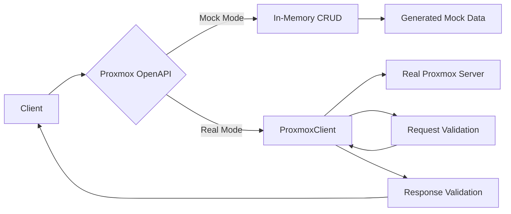

# Proxmox OpenAPI

**Schema-driven FastAPI package for Proxmox API**: OpenAPI generation, mock data, and real API connections with validation.

---

## Features

### 🔄 Auto-Generated OpenAPI Schema
Crawl the official [Proxmox API Viewer](https://pve.proxmox.com/pve-docs/api-viewer/) and automatically generate complete OpenAPI 3.0 schemas with **646 operations** across **428 endpoints**.

### 🎭 Mock API Mode (Default)
Perfect for development and testing:

- **In-memory CRUD operations** - Create, read, update, and delete mock Proxmox resources
- **Pre-generated 646 endpoints** - Full Proxmox API surface ready to use
- **Custom mock data loading** - Inject your own test data via JSON/YAML files
- **State persistence** - Mock data persists across requests during runtime
- **No Proxmox server required** - Test your code without a real Proxmox cluster

### 🔗 Real API Mode
Connect to actual Proxmox servers:

- **Full HTTP client** with aiohttp - Efficient async connections
- **Request/response validation** - Pydantic models ensure data integrity
- **Multiple auth methods** - API tokens or username/password
- **SSL verification control** - Flexible certificate handling
- **Production-ready** - Battle-tested error handling and logging

### 📚 FastAPI Integration
- **Automatic Swagger UI** at `/docs` - Interactive API exploration
- **ReDoc documentation** at `/redoc` - Clean, readable API docs
- **OpenAPI JSON** at `/openapi.json` - Machine-readable schema

---

## Quick Start

### Installation

```bash
pip install proxmox-sdk
```

### Run Mock API (Default)

```bash
# Using the command-line tool
proxmox-sdk-mock

# Or with uvicorn directly
uvicorn proxmox_sdk.mock_main:app
```

Visit `http://localhost:8000/docs` to see **646 Proxmox API endpoints** ready to use!

### Connect to Real Proxmox

```bash
# Set environment variables
export PROXMOX_API_MODE=real
export PROXMOX_API_URL=https://pve.example.com:8006
export PROXMOX_API_TOKEN_ID=user@pam!mytoken
export PROXMOX_API_TOKEN_SECRET=xxxxxxxx-xxxx-xxxx-xxxx-xxxxxxxxxxxx

# Run the API
uvicorn proxmox_sdk.main:app
```

All requests now route to your real Proxmox server with full validation!

---

## Use Cases

### For Developers
- **Test Proxmox integrations** without a real cluster
- **Prototype applications** with full API mocking
- **CI/CD pipelines** with consistent mock data
- **Local development** without VPN/network access

### For DevOps/SRE
- **API exploration** with interactive Swagger docs
- **Schema validation** for automation scripts
- **Custom tooling** built on validated Proxmox operations
- **Production API proxy** with request/response logging

### For QA/Testing
- **Automated testing** with reproducible mock data
- **Integration tests** without environment dependencies
- **Load testing** against mock endpoints
- **Regression testing** with versioned schemas

---

## Architecture



**Mock Mode**: Requests → Generated Endpoints → In-Memory State → Mock Response

**Real Mode**: Requests → Validation → aiohttp Client → Proxmox API → Validation → Response

---

## Documentation

- **[Installation](installation.md)** - Detailed installation instructions
- **[Quick Start](quickstart.md)** - Get up and running in 5 minutes
- **[Mock API Mode](mock-api.md)** - Complete guide to mock mode features
- **[Real API Mode](real-api.md)** - Connect to real Proxmox servers
- **[API Reference](api-reference.md)** - Endpoint documentation
- **[Development](development.md)** - Contributing and development guide
- **[Architecture](architecture.md)** - How it works under the hood
- **[FAQ](faq.md)** - Common questions and troubleshooting

---

## Example: Create a VM (Mock Mode)

```python
import httpx

# POST to create a VM
response = httpx.post(
    "http://localhost:8000/api2/json/nodes/pve/qemu",
    json={
        "vmid": 100,
        "name": "test-vm",
        "memory": 2048,
        "cores": 2,
    }
)

print(response.json())
# {'vmid': 100, 'name': 'test-vm', 'memory': 2048, 'cores': 2, ...}

# GET to retrieve the VM
response = httpx.get("http://localhost:8000/api2/json/nodes/pve/qemu/100")
print(response.json())
# Returns the same VM data - state persisted!
```

---

## Example: Real Proxmox Connection

```python
import os
from proxmox_sdk.main import create_app

# Configure real API connection
os.environ["PROXMOX_API_MODE"] = "real"
os.environ["PROXMOX_API_URL"] = "https://pve.example.com:8006"
os.environ["PROXMOX_API_TOKEN_ID"] = "user@pam!mytoken"
os.environ["PROXMOX_API_TOKEN_SECRET"] = "your-secret"

# Create app in real mode
app = create_app()

# Now all requests route to your real Proxmox server
# with full Pydantic validation on requests and responses!
```

---

## Project Status

- ✅ **Stable**: Mock API mode fully functional
- ✅ **Production Ready**: Real API mode tested with Proxmox VE 7.x and 8.x
- 🔄 **Active Development**: Regular updates and improvements
- 📦 **PyPI Published**: `pip install proxmox-sdk`

---

## License

MIT License - see LICENSE file for details

---

## Support

- **GitHub Issues**: [Report bugs or request features](https://github.com/emersonfelipesp/proxmox-sdk/issues)
- **GitHub Discussions**: [Ask questions and share ideas](https://github.com/emersonfelipesp/proxmox-sdk/discussions)
- **Documentation**: [Full documentation site](https://emersonfelipesp.github.io/proxmox-sdk/)

---

## Next Steps

- **[Install proxmox-sdk →](installation.md)**
- **[Follow the Quick Start guide →](quickstart.md)**
- **[Explore Mock API Mode →](mock-api.md)**
- **[Connect to Real Proxmox →](real-api.md)**
