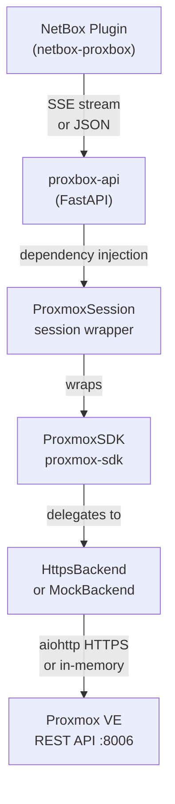
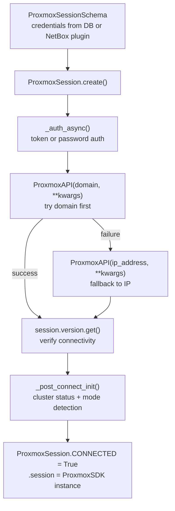
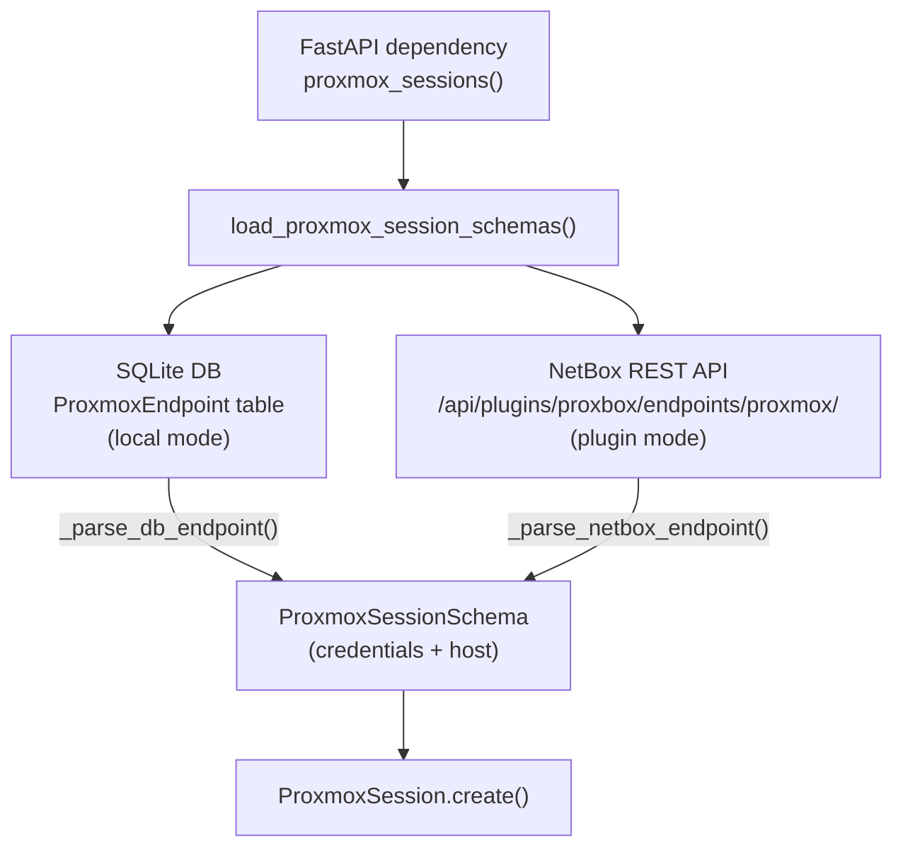

# Integration: proxbox-api

This page documents exactly how `proxbox-api` consumes the `proxmox-sdk` SDK — with real code snippets and explanations. It is a practical guide for anyone building a similar integration or extending the existing one.

!!! info "Code source"
    All snippets are taken directly from the `proxbox-api` codebase at `/root/nms/proxbox-api/`. File paths and line references are accurate at the time of writing.

---

## Overview

`proxbox-api` sits between NetBox and Proxmox VE. It uses the `proxmox-sdk` SDK to query Proxmox data, transforms that data into NetBox objects, and streams sync progress back to the plugin.



---

## Session Factory: `ProxmoxAPI()`

`proxbox-api` does not call `ProxmoxSDK()` directly. Instead it goes through a compatibility wrapper that auto-detects whether to use mock mode:

```python title="proxbox_api/session/proxmox.py"
from proxmox_sdk import ProxmoxSDK


def _should_use_mock() -> bool:
    """Return True if any test/mock environment signal is present."""
    if os.getenv("PROXMOX_API_MODE") == "mock":
        return True
    if os.getenv("PYTEST_CURRENT_TEST"):   # set automatically by pytest
        return True
    if os.getenv("TESTING") == "1":
        return True
    return False


def ProxmoxAPI(host: str, backend: str | None = None, **kwargs: object) -> ProxmoxSDK:
    """Return a ProxmoxSDK using mock when in test/CI environments."""
    if backend is None and _should_use_mock():
        backend = "mock"
    return ProxmoxSDK(host=host, backend=backend or "https", **kwargs)
```

**Why the wrapper?**

- Centralizes the mock/real decision in one place
- All test code automatically gets mock backend without explicit per-test setup
- Production code is unchanged — `ProxmoxAPI("pve.example.com", ...)` behaves exactly like `ProxmoxSDK("pve.example.com", ...)` in production

---

## ProxmoxSession: The Integration Layer

`ProxmoxSession` in `proxbox_api/session/proxmox_core.py` wraps a raw `ProxmoxSDK` instance and adds:

- Domain → IP address fallback for connectivity resilience
- Token vs password authentication dispatch
- Proxmox cluster/standalone mode detection
- Node fingerprint collection
- Credential protection via `SensitiveString`



### Authentication Flow

```python title="proxbox_api/session/proxmox_core.py"
async def _auth_async(self) -> Any:
    auth_method = "token" if (self.token_name and self._get_token_value()) else "password"
    kwargs = self._build_auth_kwargs(auth_method)

    # Try domain first, then IP address
    if self.domain:
        try:
            proxmox_session = _proxmox_api_factory()(self.domain, **kwargs)
            self.version = await resolve_async(proxmox_session.version.get())
            return proxmox_session
        except Exception as error:
            logger.info("Domain failed, trying IP %s: %s", self.ip_address, error)

    # Fallback to IP address
    proxmox_session = _proxmox_api_factory()(self.ip_address, **kwargs)
    self.version = await resolve_async(proxmox_session.version.get())
    return proxmox_session
```

The first SDK call after creating the session is `proxmox_session.version.get()` — this acts as a connectivity health check and captures the Proxmox version for logging.

### Credential Protection

Passwords and token values are stored as `SensitiveString` objects to prevent accidental exposure in logs or exception tracebacks:

```python title="proxbox_api/session/proxmox_core.py"
class SensitiveString:
    def __str__(self) -> str:
        return "[REDACTED]"

    def __repr__(self) -> str:
        return "[REDACTED]"

    def get(self) -> str | None:
        return self._value  # actual value only available via .get()
```

### Cluster vs Standalone Detection

After authentication, `_post_connect_init()` calls `session("cluster/status").get()` and inspects the result to determine the cluster topology:

```python title="proxbox_api/session/proxmox_core.py"
async def _post_connect_init(self) -> None:
    self.cluster_status = await resolve_async(self.session("cluster/status").get())
    self.mode = self._get_cluster_mode()   # "cluster" or "standalone"

    if self.mode == "cluster":
        self.cluster_name = self._get_cluster_name()
        self.fingerprints = await self._get_node_fingerprints_async(self.proxmox)
    elif self.mode == "standalone":
        self.node_name = self._get_standalone_name()
```

A standalone node returns a single item list with `{"type": "node", ...}`. A cluster returns multiple items including a `{"type": "cluster", ...}` entry.

---

## Credential Resolution

`ProxmoxSession` instances are constructed from credentials resolved from two possible sources:



**Database path** (`proxbox_api/session/proxmox_providers.py`):
```python
endpoint.get_decrypted_password()      # AES-GCM decrypted field
endpoint.get_decrypted_token_value()   # AES-GCM decrypted field
```

**NetBox plugin path** reads from the NetBox REST API and normalizes the IP address field (strips CIDR mask from `ip_address.address`).

---

## Two SDK Calling Conventions

`proxbox-api` uses two distinct calling styles depending on context:

=== "Attribute-chain (typed helpers)"

    The preferred modern style used in `proxmox_helpers.py`. Each segment of the API path becomes a Python attribute or call:

    ```python
    # VM config for a QEMU VM
    session.session.nodes(node).qemu(vmid).config.get()
    # → GET /api2/json/nodes/{node}/qemu/{vmid}/config

    # LXC container config
    session.session.nodes(node).lxc(vmid).config.get()
    # → GET /api2/json/nodes/{node}/lxc/{vmid}/config

    # Guest agent network interfaces
    session.session.nodes(node).qemu(vmid).agent("network-get-interfaces").get()
    # → GET /api2/json/nodes/{node}/qemu/{vmid}/agent/network-get-interfaces

    # VM snapshots
    session.session.nodes(node).qemu(vmid).snapshot.get()
    # → GET /api2/json/nodes/{node}/qemu/{vmid}/snapshot

    # Node storage content
    session.session.nodes(node).storage(storage).content.get(**params)
    # → GET /api2/json/nodes/{node}/storage/{storage}/content?...

    # Storage config
    session.session.storage(storage_id).get()
    # → GET /api2/json/storage/{storage_id}
    ```

=== "Path-string (generic calls)"

    The older style used in route handlers and post-connect initialization. Passes the entire path as a string to the session:

    ```python
    # Cluster status
    session.session("cluster/status").get()
    # → GET /api2/json/cluster/status

    # Cluster resources (with query param)
    session.session("cluster/resources").get(type=resource_type)
    # → GET /api2/json/cluster/resources?type=vm

    # Node fingerprints
    px("cluster/config/join").get()
    # → GET /api2/json/cluster/config/join

    # Node network interfaces
    session.session(f"/nodes/{node}/network").get(type=type)
    # → GET /api2/json/nodes/{node}/network?type=...

    # Task status
    session.session.nodes(node).tasks(upid).status.get()
    # → GET /api2/json/nodes/{node}/tasks/{upid}/status
    ```

Both styles are equivalent at the SDK level — they produce the same final URL. The attribute-chain style is preferred in new code because it benefits from IDE completion and is easier to refactor.

---

## `resolve_async()`: Sync/Async Transparency

All SDK calls in `proxbox-api` are wrapped through `resolve_async()`:

```python title="proxbox_api/proxmox_async.py"
async def resolve_async(value: object) -> object:
    """Await coroutines and consume async iterables recursively."""
    if inspect.isawaitable(value):
        return await resolve_async(await value)
    if isinstance(value, (AsyncIterator, AsyncIterable)):
        return [item async for item in value]
    return value
```

This handles the case where an SDK backend returns either a plain value or a coroutine — `proxbox-api` never needs to check which one it got. Usage:

```python
result = await resolve_async(session.session("cluster/status").get())
```

---

## Typed Helpers Pattern

`proxbox_api/services/proxmox_helpers.py` provides a typed wrapper layer on top of the raw SDK calls. Each helper:

1. Calls the SDK using the attribute-chain or path-string style
2. Wraps the result with `resolve_async()`
3. Validates the response against a generated Pydantic model
4. Raises `ProxboxException` on failure

### Example: Cluster Status

```python title="proxbox_api/services/proxmox_helpers.py"
@_dual_mode
async def get_cluster_status(
    session: ProxmoxSession,
) -> list[generated_models.GetClusterStatusResponseItem]:
    """Get cluster status from Proxmox."""
    try:
        result = await resolve_async(session.session("cluster/status").get())
        validated = generated_models.GetClusterStatusResponse.model_validate(result)
        return validated.root
    except ProxboxException:
        raise
    except Exception as error:
        raise ProxboxException(
            message="Error fetching Proxmox cluster status",
            python_exception=str(error),
        )
```

### Example: VM Config with Pydantic Validation

```python title="proxbox_api/services/proxmox_helpers.py"
@_dual_mode
async def get_vm_config(
    session: ProxmoxSession,
    node: str,
    vm_type: str,
    vmid: int,
) -> generated_models.GetNodesNodeQemuVmidConfigResponse | generated_models.GetNodesNodeLxcVmidConfigResponse:
    """Get VM configuration from Proxmox."""
    try:
        if vm_type == "qemu":
            payload = await resolve_async(session.session.nodes(node).qemu(vmid).config.get())
            return generated_models.GetNodesNodeQemuVmidConfigResponse.model_validate(payload)
        if vm_type == "lxc":
            payload = await resolve_async(session.session.nodes(node).lxc(vmid).config.get())
            return generated_models.GetNodesNodeLxcVmidConfigResponse.model_validate(payload)
        raise ValueError(f"Unsupported VM type: {vm_type}")
    except ProxboxException:
        raise
    except Exception as error:
        raise ProxboxException(
            message="Error fetching Proxmox VM config",
            python_exception=str(error),
        )
```

### Example: Node Storage Content with Filters

```python title="proxbox_api/services/proxmox_helpers.py"
@_dual_mode
async def get_node_storage_content(
    session: ProxmoxSession,
    node: str,
    storage: str,
    **kwargs: object,
) -> list[generated_models.GetNodesNodeStorageStorageContentResponseItem]:
    """Get storage content from a specific node."""
    try:
        params = {key: value for key, value in kwargs.items() if value is not None}
        result = await resolve_async(
            session.session.nodes(node).storage(storage).content.get(**params)
        )
        validated = generated_models.GetNodesNodeStorageStorageContentResponse.model_validate(result)
        return validated.root
    except ProxboxException:
        raise
    except Exception as error:
        raise ProxboxException(
            message="Error fetching Proxmox node storage content",
            python_exception=str(error),
        )
```

### The `@_dual_mode` Decorator

Every helper in `proxmox_helpers.py` is decorated with `@_dual_mode`, which lets the same async function be called from both async routes and sync test code:

```python title="proxbox_api/services/proxmox_helpers.py"
def _dual_mode(async_fn):
    @functools.wraps(async_fn)
    def wrapper(*args, **kwargs):
        try:
            asyncio.get_running_loop()
        except RuntimeError:
            # No running loop — we're in sync context; run to completion
            return asyncio.run(async_fn(*args, **kwargs))
        return async_fn(*args, **kwargs)  # Already in async context; return coroutine
    return wrapper
```

### Complete Helper Reference

| Function | SDK call | Validated model |
|---|---|---|
| `get_cluster_status()` | `session("cluster/status").get()` | `GetClusterStatusResponse` |
| `get_cluster_resources()` | `session("cluster/resources").get(type=...)` | `GetClusterResourcesResponse` |
| `get_cluster_replication()` | `session("cluster/replication").get()` | raw list |
| `get_vm_config()` | `session.nodes(n).qemu(v).config.get()` | `GetNodesNodeQemuVmidConfigResponse` |
| `get_qemu_guest_agent_network_interfaces()` | `session.nodes(n).qemu(v).agent("network-get-interfaces").get()` | normalized list |
| `get_storage_list()` | `session.storage.get()` | `GetStorageResponse` |
| `get_storage_config()` | `session.storage(sid).get()` | `GetStorageStorageResponse` |
| `get_node_storage_content()` | `session.nodes(n).storage(s).content.get(...)` | `GetNodesNodeStorageStorageContentResponse` |
| `get_node_tasks()` | `session.nodes(n).tasks.get(...)` | `GetNodesNodeTasksResponse` |
| `get_node_task_status()` | `session.nodes(n).tasks(upid).status.get()` | `GetNodesNodeTasksUpidStatusResponse` |
| `get_vm_snapshots()` | `session.nodes(n).qemu(v).snapshot.get()` | raw list |

---

## Error Handling

`proxbox-api` catches `ResourceException` from the SDK and wraps it in `ProxboxException` to add structured error detail for SSE/JSON responses:

```python title="proxbox_api/routes/proxmox/__init__.py"
from proxmox_sdk.sdk.exceptions import ResourceException

# Version check endpoint
try:
    version = await resolve_async(px.session.version.get())
except ResourceException as error:
    raise HTTPException(
        status_code=502,
        detail=(
            f"Failed to query Proxmox version for endpoint '{px.name}'. "
            f"Upstream responded with HTTP {error.status_code} {error.status_message}."
        ),
    ) from error

# VM config
try:
    config = await resolve_async(px.session(f"nodes/{node}/qemu/{vmid}/config").get())
except ResourceException as error:
    raise ProxboxException(
        message="Error getting VM Config",
        python_exception=f"Error: {str(error)}",
    )
```

The `ResourceException` carries `status_code`, `status_message`, `content`, and optional `errors` dict — enough context to produce a meaningful error message without exposing internal details.

---

## Runtime-Generated Routes

`proxbox-api` dynamically builds an entire route namespace from the Proxmox OpenAPI schema using `proxbox_api/routes/proxmox/runtime_generated.py`. Each generated endpoint resolves a `ProxmoxSession` via dependency injection and calls the SDK using the path-string convention:

```python title="proxbox_api/routes/proxmox/runtime_generated.py (pattern)"
# For each endpoint in the OpenAPI spec:
resource = target.session(_render_proxmox_path(openapi_path, path_values).lstrip("/"))
handler = getattr(resource, method.lower())

if method.upper() == "GET":
    result = await resolve_async(handler(**query_values))
else:
    result = await resolve_async(handler(**payload))
```

`_render_proxmox_path()` converts OpenAPI path templates (`/nodes/{node}/qemu/{vmid}/config`) into actual paths (`/nodes/pve1/qemu/100/config`) using the route's path parameter values.

This means `proxbox-api` exposes the entire 646-endpoint Proxmox API surface through its own authenticated proxy without writing a single line of per-endpoint handler code.

---

## Mock Mode in Tests

For integration tests, `proxbox-api` ships `MockProxmoxContext` in `proxbox_api/testing/proxmox_mock.py`:

```python title="proxbox_api/testing/proxmox_mock.py (pattern)"
async def __aenter__(self) -> Any:
    from proxmox_sdk import ProxmoxSDK
    backend, host = self._detect_backend()   # "mock" if TESTING=1 or env var set
    self._sdk = ProxmoxSDK(host=host, backend=backend, user="root@pam", password="test")
    return self._sdk

async def __aexit__(self, *args) -> None:
    await self._sdk.close()
```

Tests that use this context manager get an in-memory mock SDK that behaves identically to the production SDK, so the full service layer can be tested without a real Proxmox server.

---

## Sync Stage → SDK Call Mapping

Each of the 12 synchronization stages in `proxbox-api` calls specific SDK endpoints:

| Stage | Primary SDK calls |
|---|---|
| **devices** (Proxmox nodes) | `cluster/status`, `cluster/resources` |
| **storage** | `storage.get()`, `storage(id).get()` |
| **virtual-machines** | `cluster/resources(type="vm")`, `nodes(n).qemu(v).config.get()` |
| **virtual-disks** | `nodes(n).qemu(v).config.get()` (parse disk fields) |
| **task-history** | `nodes(n).tasks.get(...)` |
| **backups** | `nodes(n).storage(s).content.get(content="backup")` |
| **snapshots** | `nodes(n).qemu(v).snapshot.get()` |
| **node-interfaces** | `nodes/{node}/network` (path-string) |
| **vm-interfaces** | `nodes(n).qemu(v).agent("network-get-interfaces").get()` |
| **vm-ip-addresses** | same as vm-interfaces |
| **replications** | `cluster/replication` (path-string or `cluster.replication.get()`) |
| **backup-routines** | `cluster/backup` (path-string or `cluster.backup.get()`) |
