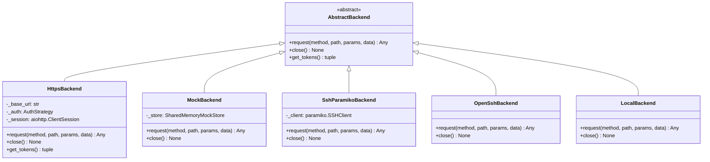
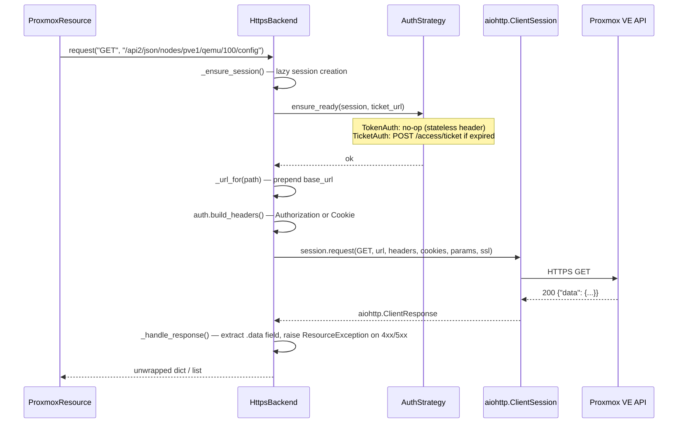
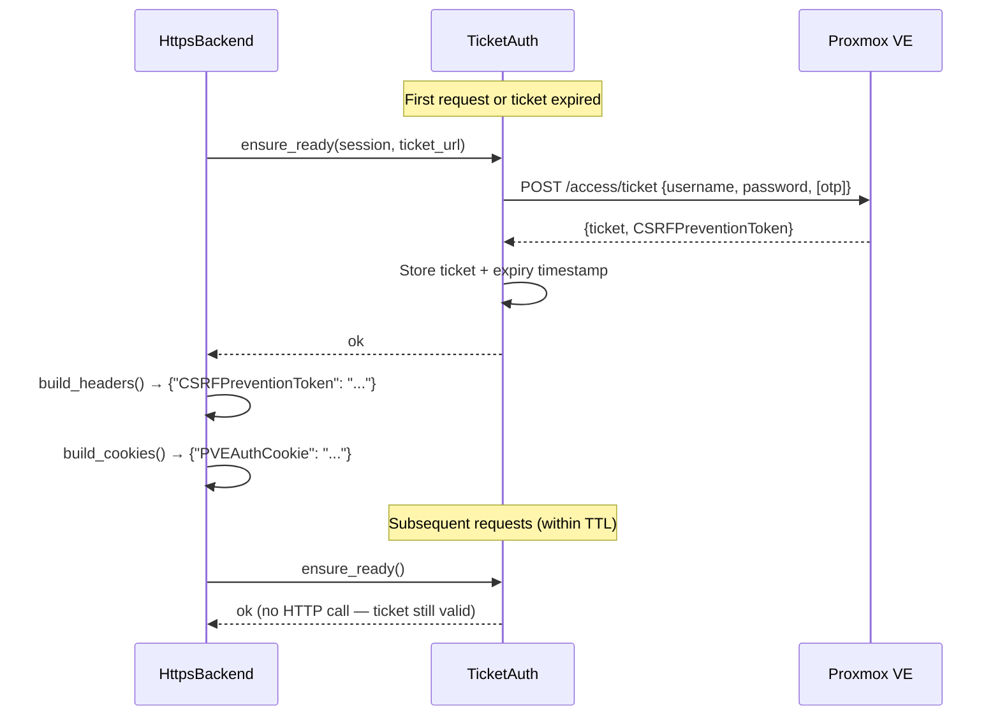

# SDK Internals

This page explains how the `proxmox-sdk` SDK works under the hood — the attribute-based resource navigation engine, the backend abstraction layer, the two authentication strategies, and the performance patterns that make every part fast.

---

## Resource Navigation Engine

The core of the SDK is `ProxmoxResource` in `proxmox_sdk/sdk/resource.py`. It implements a fluent builder pattern where every attribute access or call extends a URL path and returns a new resource — with zero actual HTTP traffic until you call an HTTP method.


### How `__getattr__` Builds Paths

`ProxmoxResource` uses `__slots__` and overrides `__getattr__` so that every attribute that doesn't start with `_` creates a new resource with the attribute name appended to the path:

```python title="proxmox_sdk/sdk/resource.py"
class ProxmoxResource:
    __slots__ = ("_path", "_backend")

    def __getattr__(self, item: str) -> ProxmoxResource:
        if item.startswith("_"):
            raise AttributeError(item)
        return ProxmoxResource(
            path=_url_join(self._path, item),
            backend=self._backend,
        )
```

Each new `ProxmoxResource` shares the same `_backend` reference (no copy), so the navigation chain has zero allocation overhead beyond the path string itself.

### How `__call__` Adds Resource IDs

Calling a resource adds a dynamic ID segment. The call accepts strings, ints, lists, and slash-separated strings:

```python title="proxmox_sdk/sdk/resource.py"
def __call__(
    self,
    resource_id: str | int | list | tuple | None = None,
) -> ProxmoxResource:
    if resource_id is None:
        return self
    if isinstance(resource_id, (list, tuple)):
        # nodes(["pve1", "qemu", "100"]) → /nodes/pve1/qemu/100
        return ProxmoxResource(
            path=_url_join(self._path, *[str(r) for r in resource_id]),
            backend=self._backend,
        )
    # nodes("pve1/qemu/100") — slash-split shorthand
    return ProxmoxResource(
        path=_url_join(self._path, *str(resource_id).split("/")),
        backend=self._backend,
    )
```

All forms produce identical URL paths:

```python
# All equivalent — produce /api2/json/nodes/pve1/qemu/100/config
proxmox.nodes("pve1").qemu(100).config
proxmox.nodes("pve1").qemu("100").config
proxmox.nodes("pve1/qemu/100").config
proxmox.nodes(["pve1", "qemu", "100"]).config
```

### Path Construction

The internal `_url_join()` function uses `posixpath.join` with percent-encoding for path segments. It has a fast path that avoids `urlsplit`/`urlunsplit` for the common case of relative paths (no `://`):

```python title="proxmox_sdk/sdk/resource.py"
def _url_join(base: str, *args: str) -> str:
    if "://" not in base:
        return posixpath.join(base or "/", *[quote(str(a), safe="") for a in args])
    # Full URL: re-parse and re-assemble
    scheme, netloc, path, query, fragment = urlsplit(base)
    path = posixpath.join(path or "/", *[quote(str(a), safe="") for a in args])
    return urlunsplit((scheme, netloc, path, query, fragment))
```

### HTTP Methods

All five HTTP verbs plus two proxmoxer-compatible aliases are implemented on `ProxmoxResource`. Each method calls the backend's `request()` with the correct verb:

```python title="proxmox_sdk/sdk/resource.py"
async def get(self, *path_args: str, **params: Any) -> Any:
    resource = self._extend(*path_args)
    return await resource._backend.request(
        "GET",
        resource._path,
        params=_filter_none(params) or None,
    )

async def post(self, *path_args: str, **data: Any) -> Any:
    resource = self._extend(*path_args)
    return await resource._backend.request(
        "POST", resource._path, data=_filter_none(data) or None,
    )

# put, patch, delete follow the same pattern
# create() is an alias for post()
# set() is an alias for put()
```

`_filter_none()` removes `None` keyword arguments before they are sent, preventing Proxmox API errors caused by empty parameters. It has a fast path that returns the original dict unchanged when no `None` values are present.

---

## Backend Architecture

Every backend implements the two-method `AbstractBackend` protocol:



### Backend Comparison

| Backend | Transport | Auth | Use Case |
|---|---|---|---|
| `https` | aiohttp over TLS | API token or password/ticket | Production — real Proxmox |
| `mock` | In-memory dict store | None | Testing without Proxmox |
| `ssh_paramiko` | Paramiko SSH → pvesh | SSH key or password | Hosts without open port 8006 |
| `openssh` | openssh subprocess → pvesh | SSH key | Hosts without open port 8006 |
| `local` | Local pvesh subprocess | None (runs as root) | Scripts on the Proxmox host itself |

### HTTPS Backend Request Lifecycle

The HTTPS backend is the primary production transport. Its `request()` method follows this flow:



#### URL Construction

The backend caches `(scheme, netloc, base_path)` in `__init__` to avoid parsing the base URL on every request:

```python title="proxmox_sdk/sdk/backends/https.py"
_parsed = urlsplit(self._base_url)
self._base_scheme = _parsed.scheme
self._base_netloc = _parsed.netloc
self._base_path = _parsed.path or "/"

def _url_for(self, path: str) -> str:
    joined_path = posixpath.join(self._base_path, path.lstrip("/"))
    return urlunsplit((self._base_scheme, self._base_netloc, joined_path, "", ""))
```

#### Response Unwrapping

Proxmox API responses always wrap data in `{"data": ...}`. The backend extracts this automatically so callers receive the unwrapped value:

```python title="proxmox_sdk/sdk/backends/https.py"
async def _handle_response(self, resp, method, path) -> Any:
    raw = await resp.json(content_type=None)
    if resp.status >= 400:
        raise ResourceException(
            status_code=resp.status,
            status_message=resp.reason,
            content=str(raw.get("data", "")),
            errors=raw.get("errors"),
        )
    if isinstance(raw, dict) and "data" in raw:
        return raw["data"]   # ← automatic unwrap
    return raw
```

---

## Authentication Internals

The SDK provides two concrete `AuthStrategy` implementations that are selected automatically based on the credentials supplied to `ProxmoxSDK`.

### Token Auth (`TokenAuth`)

API token authentication is stateless — no pre-request HTTP call needed. `TokenAuth.build_headers()` returns an `Authorization` header with the `PVEAPIToken` scheme:

```python title="proxmox_sdk/sdk/auth/token.py (pattern)"
# Header format: PVEAPIToken=user@realm!token-name=uuid
headers["Authorization"] = f"PVEAPIToken={user}@{realm}!{token_name}={token_value}"
```

`ensure_ready()` is a no-op — token auth is always ready.

### Ticket Auth (`TicketAuth`)

Password authentication requires an initial POST to `/access/ticket` to exchange credentials for a `PVEAuthCookie` and `CSRFPreventionToken`. The ticket has a 2-hour TTL; `ensure_ready()` automatically refreshes it when it expires:



`TicketAuth` receives the same SSL context **and the same proxy** as the main HTTPS backend, so `verify_ssl=False` and `proxies=` apply consistently to the auth call and all subsequent API requests. This ensures the SDK works correctly in proxy-only networks where the authentication POST would otherwise bypass the proxy.

### Auth Selection in `ProxmoxSDK`

The backend factory in `ProxmoxSDK._create_backend()` decides which auth class to use based on which credentials are supplied:

```python title="proxmox_sdk/sdk/api.py"
if token_name and token_value:
    auth = TokenAuth(user=user, token_name=token_name, token_value=token_value, ...)
elif user and password:
    auth = TicketAuth(username=user, password=password, service_config=svc, ...)
else:
    raise ValueError("HTTPS backend requires credentials")
```

---

## Mock Backend

The `MockBackend` implements `AbstractBackend` using an in-memory `SharedMemoryMockStore`. It loads the pre-generated Proxmox VE 8.1 OpenAPI schema and generates mock responses that satisfy the schema's property definitions.

```python title="proxmox_sdk/sdk/api.py (class method)"
@classmethod
def mock(cls, schema_version: str = "latest", service: str = "PVE") -> ProxmoxSDK:
    from proxmox_sdk.sdk.backends.mock import MockBackend
    backend = MockBackend(schema_version=schema_version, api_path_prefix=svc.api_path_prefix)
    instance._root = ProxmoxResource(path=svc.api_path_prefix, backend=backend)
    return instance
```

The mock backend supports the same attribute-chain and path-string navigation styles as the HTTPS backend — code written against mock works against real Proxmox without changes.

!!! tip "Mock state persistence"
    Mock state is per-process and resets on restart. For test isolation, reset state between tests using `POST /mock/reset` on the FastAPI server, or create a new `ProxmoxSDK.mock()` instance per test.

---

## Services Layer

Three Proxmox services are supported, each with their own API path prefix and default port:

| Service | API Prefix | Default Port | Description |
|---|---|---|---|
| `PVE` | `/api2/json` | `8006` | Proxmox VE (default) |
| `PMG` | `/api2/json` | `8006` | Proxmox Mail Gateway |
| `PBS` | `/api2/json` | `8007` | Proxmox Backup Server |

Service selection determines which backends are available and which endpoints the schema covers.

---

## Task Monitoring

The SDK ships `proxmox_sdk.sdk.tools.tasks.Tasks` for polling Proxmox task UPIDs until they complete. The polling loop uses **exponential backoff** to avoid hammering the API:

```
Poll interval: 1s → 2s → 4s → 8s → 16s → 30s (cap)
```

`blocking_status()` uses `time.monotonic()` for accurate timeout tracking independent of system clock adjustments.

---

## File Upload

The `HttpsBackend` automatically detects file uploads when the `data` dict contains `io.IOBase` values. Files under 10 MiB are sent as standard multipart form data. Files over 10 MiB use `aiohttp`'s streaming multipart encoding to avoid loading the entire file into memory. The upload timeout is extended to **3600 s** to accommodate large ISOs.

---

## Sync Wrapper

`SyncProxmoxSDK` wraps `ProxmoxSDK` with a dedicated `asyncio` event loop so that blocking (non-`async`) code can use the SDK:

```python title="proxmox_sdk/sdk/sync.py (pattern)"
with ProxmoxSDK.sync(host="pve.example.com", user="admin@pam", password="secret") as proxmox:
    nodes = proxmox.nodes.get()       # blocks — no await needed
    vms = proxmox.nodes("pve1").qemu.get()
```

`SyncProxmoxResource` intercepts every async call and runs it synchronously on the embedded loop via `loop.run_until_complete()`.

!!! warning "Do not mix sync and async"
    `SyncProxmoxSDK` creates its own event loop. Using it inside an already-running async context will raise `RuntimeError: This event loop is already running`. Use `ProxmoxSDK` (async) in FastAPI, asyncio scripts, and pytest-asyncio tests.

---

## Exception Hierarchy

All SDK exceptions live in `proxmox_sdk.sdk.exceptions` and are re-exported from the top-level `proxmox_sdk` package.

```
ProxmoxSDKError (base)
├── ResourceException          HTTP ≥ 400 from the Proxmox API
│   ├── ProxmoxTimeoutError    Request exceeded timeout (status_code=504)
│   └── ProxmoxConnectionError TCP refused, DNS failure, SSL error (status_code=503)
├── AuthenticationError        Bad credentials, NeedTFA without OTP, or auth timeout
└── BackendNotAvailableError   Optional backend dep (paramiko, openssh_wrapper) missing
```

`ProxmoxTimeoutError` and `ProxmoxConnectionError` subclass `ResourceException` so existing `except ResourceException` handlers continue to work without modification. Catch the specific subtype first when you need to distinguish a timeout from a server-side error:

```python
from proxmox_sdk import ProxmoxTimeoutError, ProxmoxConnectionError, ResourceException

try:
    nodes = await proxmox.nodes.get()
except ProxmoxTimeoutError:
    # retry or back off
    ...
except ProxmoxConnectionError:
    # host unreachable or SSL misconfigured
    ...
except ResourceException as e:
    # Proxmox returned 4xx/5xx
    print(e.status_code, e.errors)
```

`HttpsBackend.request()` maps `aiohttp` exceptions to these types:

| `aiohttp` exception | SDK exception |
|---|---|
| `asyncio.TimeoutError` | `ProxmoxTimeoutError` |
| `aiohttp.ClientConnectorError` | `ProxmoxConnectionError` |
| `aiohttp.ClientSSLError` | `ProxmoxConnectionError` |
| other `aiohttp.ClientError` | `ProxmoxConnectionError` |
